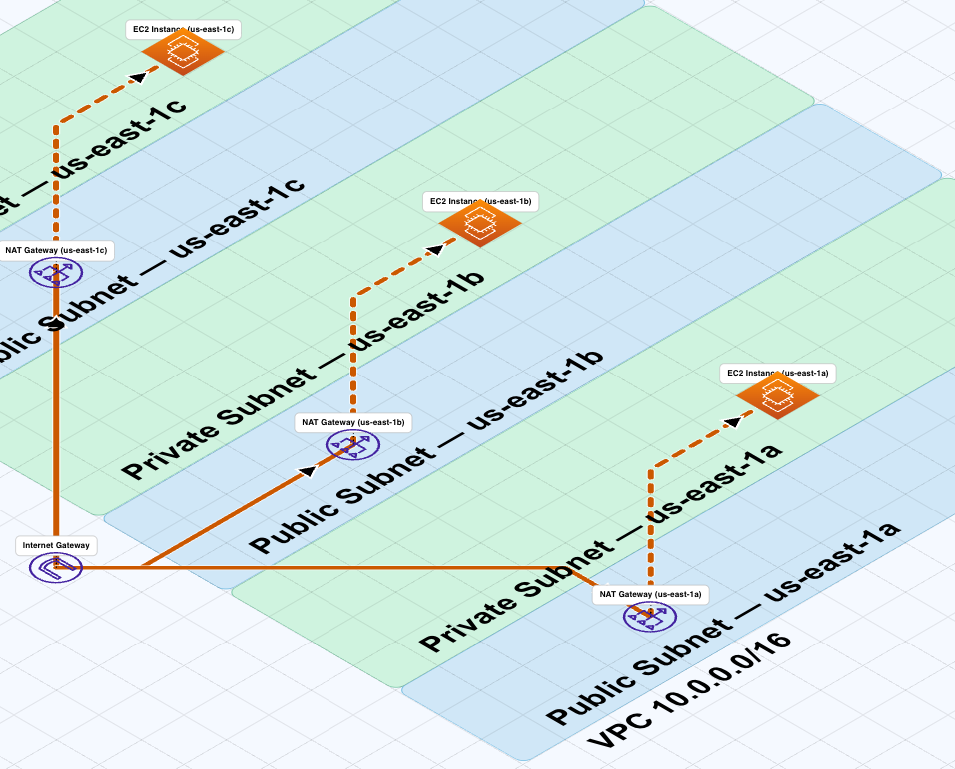

# aws-infrastructure-visualization

An [Agent Skill](https://agentskills.io) for generating **FossFLOW-importable AWS Well-Architected diagram JSON** — schema-strict, ready to paste.

## What it does

Tell Claude to draw your AWS infrastructure and get back a valid JSON object you can import directly into [FossFLOW](https://github.com/stan-smith/FossFLOW). The skill enforces the full FossFLOW `modelSchema` — every `id`, icon `name`/`url`, color `value`, connector, rectangle `from`/`to`, and `textBox` is guaranteed correct.

**Default output** (when you don't specify):

- 1 VPC · 2 Availability Zones · Public + Private subnets
- Route 53 → CloudFront → ALB → App servers → RDS
- Real AWS architecture SVG icon URLs (no placeholders)



## Installation

### Claude Code

```
/plugin add github:teddysbeach/aws-infrastructure-visualization
```

### Claude.ai / API

Add this skill via the [Agent Skills](https://agentskills.io) format. Point your agent at the raw `SKILL.md`:

```
https://raw.githubusercontent.com/teddysbeach/aws-infrastructure-visualization/main/SKILL.md
```

## Usage

Once installed, just describe the architecture you want:

```
Draw a 3-tier AWS architecture with Lambda, API Gateway, and DynamoDB
```

```
Make a VPC diagram with 3 AZs and a NAT Gateway
```

Claude will return a single raw JSON object — paste it into FossFLOW's import dialog.

## Compatibility

Requires **FossFLOW** ([stan-smith/FossFLOW](https://github.com/stan-smith/FossFLOW)). Output strictly follows the FossFLOW `modelSchema` (Zod-validated).

## License

[CC-BY-4.0](LICENSE)
